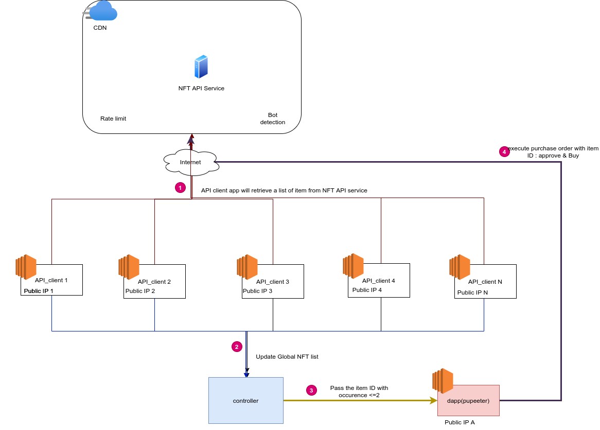

# RACA NFT Automation: A Side Project Overview

This repository hosts a side project dedicated to automating interactions with MetaMask and the RACA marketplace for buying and selling NFTs. This project was born out of the need to streamline the purchasing process, efficiently bypass rate limits, and securely manage transactions.

## Features

- **Automated RACA NFT Purchase**: Executes the latest RACA NFT purchase orders automatically.
- **Anti-Bot & Rate Limit Countermeasures**: Designed to avoid 100% rate limit and bot detection.

## Requirements

### Software and Wallets

- Puppeteer with MetaMask plugin installed
- Multiple MetaMask wallets
  - Ensure sufficient BNB for BSC transaction fees
  - Maintain RACA balance for NFT purchases
- Different IP addresses for invoking RACA endpoints

### Security Measures

- Safeguard the 12-word secret phrase for MetaMask.
  - AWS KMS can be used for encryption.
  - Local encryption methods are also acceptable.

## Future Improvements

- **Efficiency Optimization**: Reduce the loading and MetaMask wallet configuration time.
- **Data Visualization**: Implement features to track and visualize NFT price fluctuations.

## Architecture Diagram

## RACA Endpoints

- Marketplace: `https://market.radiocaca.com/#/market-place`
- Specific Item: `https://market.radiocaca.com/#/market-place/[item]`

## Release History

- Initial release: MVP

Feel free to contribute or raise issues if you find any. Thank you for visiting this project!
